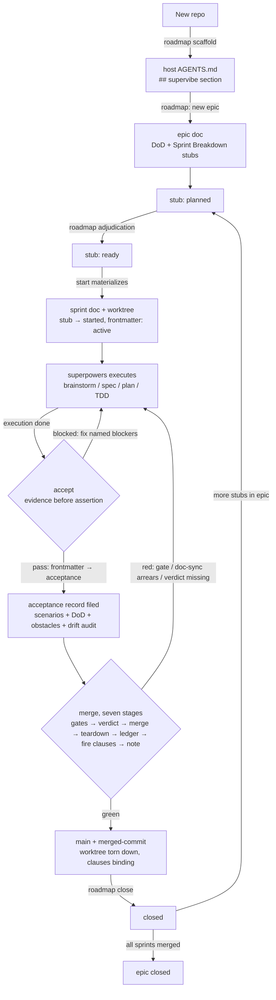
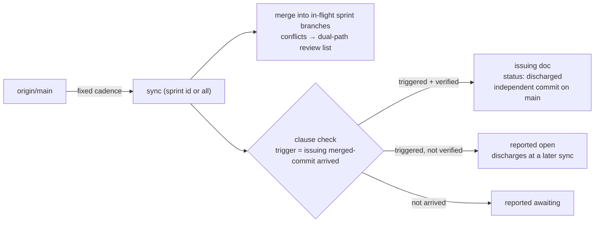

# SuperVibe

**Iteration management for Claude Code.** SuperVibe answers *what to build, in
what order, when a sprint is done, and when it may merge* — the strategy layer.
It pairs with [superpowers](https://github.com/obra/superpowers), the tactics
layer that answers *how to write the code well*.

| | SuperVibe (strategy) | superpowers (tactics) |
|---|---|---|
| Cares about | roadmap, sprint scheduling, DoD, acceptance, merge close-out, cross-sprint sync | brainstorm, spec, plan, TDD, subagent-driven dev, review loops |
| Input | roadmap + in-flight sprints | one sprint plan doc |
| Output | adjudication: "this sprint may start / may merge" | working code + docs |

The two layers couple through an **artifact contract**, not code: a sprint plan
doc and an acceptance record. SuperVibe never forks or rewrites a superpowers
skill.

## Terminology (deliberately Scrum-aligned)

Core nouns come straight from Scrum — nothing new to learn: **epic**, **sprint**,
**Definition of Done (DoD)**, **story/task**, **acceptance scenarios**.

Two explicit differences from standard Scrum:

- **A sprint is a value box, not a time box.** Close-out criterion is DoD met,
  not the calendar. A WIP limit (default 3) controls parallelism. No fixed
  length, no velocity.
- **DoD lives at the epic level.** Sprint docs copy it verbatim; it is never
  edited in place inside a sprint doc.

Four nouns with no Scrum equivalent — SuperVibe's own capabilities:

- **sprint ledger** — the authoritative frontmatter state fields in each sprint
  doc's header (decentralized; aggregated by directory scan, no central index)
- **handover clause** — a cross-sprint re-verification obligation ("when my
  change lands, you must re-check X")
- **early start** — safely opening a new sprint line before the previous one
  has closed
- **deferred dependency** — building against a target sprint as if already
  merged, with a handover clause as the safety net

## Artifacts

All artifacts are dated markdown files under the host repo's `docs/superpowers/`
(defaults; configurable):

```
docs/superpowers/
├── specs/          2026-10-01-<feature>.md     design docs (superpowers domain)
├── plans/          2026-10-01-<feature>.md     implementation plans (superpowers domain)
├── roadmaps/       2026-10-01-<epic>.md        epic docs: DoD, sprint breakdown, ADRs, open questions
├── sprints/        2026-10-01-S#-<name>.md     sprint docs: ledger frontmatter, stories, scenarios, clauses
└── acceptances/    2026-10-01-S#-acceptance.md acceptance records: evidence, verdict
```

Sprint state is a **decentralized ledger**: pre-start states (`planned`/`ready`)
live in the epic doc's Sprint Breakdown stub rows; at materialization the stub
flips to `started` and from then on state lives in the sprint doc's frontmatter
(`active → acceptance → merged → closed`). Every state flip appends a date +
evidence link.

## Lifecycle

Main chain (roadmap → start → execution → accept → merge → close):



Sync side (fixed cadence, independent of the main chain):



Key points:

- **Two state namespaces**: stub rows own `planned → ready → started`; frontmatter owns `active → acceptance → merged → closed`
- **Clause lifecycle in three acts**: registered at `start`, fired binding at `merge` stage 6, discharged at `sync`
- **Rework loops**: an accept `blocked` returns to execution; a merge red returns to execution/accept, and merge re-runs from stage 1 after the fix — a half-green run proves nothing
- **Parallelism**: `start` is bounded by `wip_limit` (default 3); with several lines in flight, `sync` is the drift fence

## Install

```
/plugin marketplace add WayJ/supervibe
/plugin install supervibe@supervibe
```

Local development:

```
claude --plugin-dir /path/to/supervibe
```

## The five skills

| skill | one line |
|---|---|
| `supervibe:roadmap` | create/close epics, scaffold the config section, manage debt, adjudicate stub rows |
| `supervibe:start` | materialize a stub row into a sprint doc + worktree; register handover clauses |
| `supervibe:accept` | run acceptance scenarios with fresh evidence, audit doc drift, issue the verdict |
| `supervibe:merge` | seven-stage close-out: gates → verdict → merge → teardown → ledger → fire clauses → note |
| `supervibe:sync` | cadence-merge `origin/main` into in-flight sprints; check and discharge handover clauses |

Every skill ships bilingual: `SKILL.md` (English truth source) + `SKILL.zh.md`
(faithful Chinese mirror).

## Host configuration

Zero stack assumptions: every project-specific value (paths, gate commands,
WIP limit, doc-sync map) lives in the host repo's `AGENTS.md`, in a `## supervibe`
section:

```markdown
## supervibe
- roadmaps_dir: docs/superpowers/roadmaps/
- sprints_dir: docs/superpowers/sprints/
- acceptances_dir: docs/superpowers/acceptances/
- notes: .agents/notes/
- debt_tracker: docs/tech-debt-tracker.md
- wip_limit: 3

### gates
- contracts: npm run test:contracts
- tests: npm test

### doc_sync_map
| change | owes |
|---|---|
| `src/db/schema.ts` | docs/generated/db-schema.md |
```

Run `supervibe:roadmap` with `scaffold` to generate this section in a new repo.

## Without superpowers

SuperVibe detects superpowers and dispatches to it (brainstorming, spec
writing, TDD). Without it, the same artifact contract is produced manually —
the artifacts are plain markdown, and the process degrades, not breaks. No hard
dependency is declared.

## Development

```
claude plugin validate . --strict   # plugin/marketplace manifest check
node tests/check-artifacts.mjs      # bilingual pairing, template completeness, assembly dry-run
```

Zero npm dependencies; Node ≥ 20.

## License

MIT
