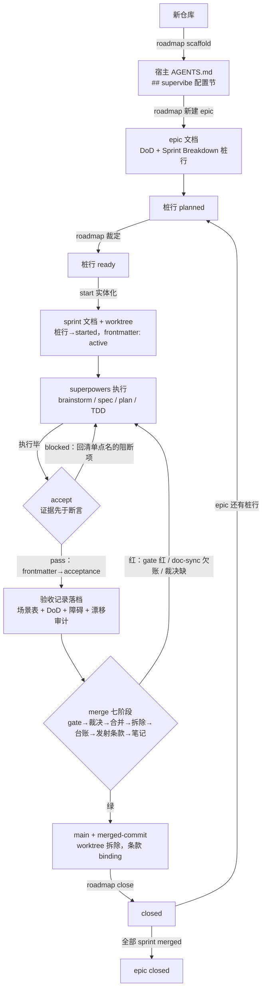
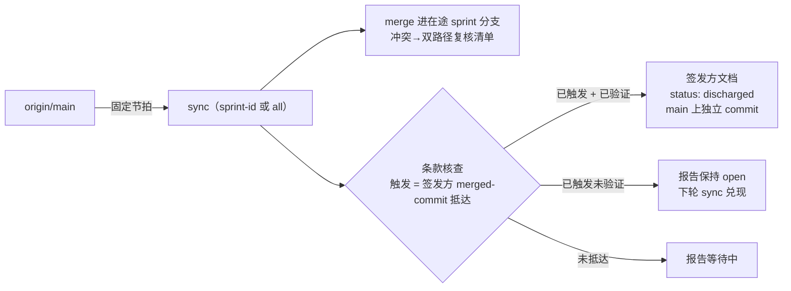

# SuperVibe（中文说明）

**Claude Code 的迭代管理层。** SuperVibe 回答「做什么、什么顺序、一个
sprint 何时算完、何时可以合入」——战略层。与
[superpowers](https://github.com/obra/superpowers) 配对使用，后者是回答
「怎么把代码写好」的战术层。

| | SuperVibe（战略层） | superpowers（战术层） |
|---|---|---|
| 关心 | roadmap、sprint 排期、DoD、验收、合并收口、跨线同步 | brainstorm、spec、plan、TDD、subagent 开发、评审环 |
| 输入 | roadmap + 在途 sprint | 一份 sprint plan 文档 |
| 输出 | 裁决：「这个 sprint 可以开工 / 可以合入」 | 可用代码 + 文档 |

两层通过**工件契约**耦合，而非代码耦合：一份 sprint plan 文档 + 一份验收
记录。SuperVibe 绝不 fork 或重写任何 superpowers 技能。

## 术语（刻意对齐 Scrum）

核心名词直接采用 Scrum 词汇——无需重复学习：**epic**、**sprint**、
**Definition of Done / DoD**、**story/task**、**acceptance scenarios**。

与标准 Scrum 的两处显式差异：

- **sprint 是价值盒，不是时间盒。** 收口判据是 DoD 达成，而非到期切刀。
  WIP 上限（默认 3）控制并行数。无固定时长、无 velocity。
- **DoD 挂在 epic 层。** sprint 文档逐字复制它，绝不在 sprint 文档内就地改写。

四个 Scrum 没有对应物的名词——SuperVibe 的增量能力：

- **sprint ledger**（sprint 台账）— 各 sprint 文档头部 frontmatter 的权威
  状态字段（去中心化，目录扫描聚合，无中心索引）
- **handover clause**（交接条款）— 跨 sprint 复核义务（「我的变更落了，
  你要复核 X」）
- **early start**（提前启动）— 前一 sprint 未收口时安全开新线
- **deferred dependency**（候补依赖）— 视同目标 sprint 已合入而先行实现，
  以交接条款兜底

## 工件

全部工件是宿主仓库 `docs/superpowers/` 下的日期化 markdown 文件（默认值，
可配置）：

```
docs/superpowers/
├── specs/          2026-10-01-<feature>.md     设计文档（superpowers 域）
├── plans/          2026-10-01-<feature>.md     实施计划（superpowers 域）
├── roadmaps/       2026-10-01-<epic>.md        epic 文档：DoD、sprint 分解、ADR、开放问题
├── sprints/        2026-10-01-S#-<name>.md     sprint 文档：台账 frontmatter、story、场景、条款
└── acceptances/    2026-10-01-S#-acceptance.md 验收记录：证据、裁决
```

sprint 状态是一张**去中心化台账**：pre-start 状态（`planned`/`ready`）住在
epic 文档的 Sprint Breakdown 桩行里；实体化时桩行翻为 `started`，此后状态
住在 sprint 文档的 frontmatter 里（`active → acceptance → merged → closed`）。
每次状态翻转都追加日期 + 证据链接。

## 生命周期

主链（roadmap → start → 执行 → accept → merge → close）：



sync 侧线（固定节拍，独立于主链）：



要点：

- **状态双命名空间**：桩行管 `planned → ready → started`；frontmatter 管 `active → acceptance → merged → closed`
- **条款三段**：start 登记 → merge 阶段 6 发射（binding）→ sync 兑现（discharged）
- **回炉路**：accept blocked 回执行；merge 红回执行/accept，修完 merge 从阶段 1 重跑——半绿不算数
- **并行**：start 受 `wip_limit` 约束（默认 3）；多线并行时 sync 是漂移围栏

## 看板

随包分发的静态查看器，一眼看全工件树。说一声「看板」，`supervibe:board`
在宿主仓生成 `.agents/board/`（页面 + parser + 烘焙的 `board-data.js`）；
打开即见每个 epic 的完整拆解——sprint 卡片按状态分列（含桩行），详情抽屉
里有 DoD、验收场景、交接条款与波次 plan 链接。零文件夹选择；重跑技能即刷新
（烘焙数据是生成时快照）。

零网络、零构建：解析全部发生在页面内存（classic 脚本 `web/parser.js`），
页面自身不写盘，仓库里永远不落索引文件。插件原版 `web/board.html` 保留
文件夹选择器兜底。渲染不了的形态以可见的数据异味出现在警告条，绝不静默
丢弃。设计：`docs/superpowers/specs/2026-10-01-board-design.md`。

## 安装

```
/plugin marketplace add WayJ/supervibe
/plugin install supervibe@supervibe
```

本地开发：

```
claude --plugin-dir /path/to/supervibe
```

## 五个技能

| 技能 | 一句话 |
|---|---|
| `supervibe:roadmap` | 创建/收口 epic、脚手架配置节、管理技术债、裁决桩行 |
| `supervibe:start` | 把桩行实体化为 sprint 文档 + worktree；登记交接条款 |
| `supervibe:accept` | 以新鲜证据真跑验收场景、审计文档漂移、出具裁决 |
| `supervibe:merge` | 七阶段收口：门禁 → 裁决 → 合并 → 拆除 → 台账 → 发射条款 → 收口笔记 |
| `supervibe:sync` | 按节拍把 `origin/main` merge 进在途 sprint；核查并兑现交接条款 |

每个技能双语交付：`SKILL.md`（英文真源）+ `SKILL.zh.md`（忠实中文镜像）。

## 宿主配置

零栈假设：一切项目 specifics（路径、门禁命令、WIP 上限、doc-sync 映射）
住在宿主仓库 `AGENTS.md` 的 `## supervibe` 节：

```markdown
## supervibe
- roadmaps_dir: docs/superpowers/roadmaps/
- sprints_dir: docs/superpowers/sprints/
- acceptances_dir: docs/superpowers/acceptances/
- notes: .agents/notes/
- debt_tracker: docs/tech-debt-tracker.md
- wip_limit: 3

### gates
- contracts: npm run test:contracts
- tests: npm test

### doc_sync_map
| change | owes |
|---|---|
| `src/db/schema.ts` | docs/generated/db-schema.md |
```

新仓库运行 `supervibe:roadmap` 的 `scaffold` 即可生成此节。

## 没有 superpowers 时

SuperVibe 检测到 superpowers 则调度它（brainstorming、spec 撰写、TDD）；
没有时，同一工件契约手动产出——工件是纯 markdown，流程降级而非中断。
不声明任何硬依赖。

## 开发

```
claude plugin validate . --strict   # plugin/marketplace manifest 校验
node tests/check-artifacts.mjs      # 双语配对、模板完整性、装配干跑
```

零 npm 依赖；Node ≥ 20。

## 许可证

MIT
